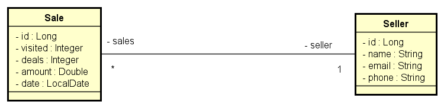

<div align="left">
  <h1><strong>DSMETA: Consulta vendas</strong></h1>
</div>

## Índice

- [Índice](#índice)
- [Sobre](#sobre)
- [Configuração Inicial](#configuração-inicial)
  - [Tipos de Relacionamentos em UML](#tipos-de-relacionamentos-em-uml)
  - [Diagrama de Classes](#diagrama-de-classes)
- [Configurando os Relacionamentos](#configurando-os-relacionamentos)
  - [Relação ManyToOne](#relação-manytoone)
  - [Relação OneToMany](#relação-onetomany)
- [Estratégia de Carregamento](#estratégia-de-carregamento)
  - [Carregamento Eager x Lazy](#carregamento-eager-x-lazy)
  - [Consulta N+1](#consulta-n1)
- [Operações CRUD](#operações-crud)
- [Notas Técnicas Adicionais](#notas-técnicas-adicionais)
- [Tecnologias Utilizadas](#tecnologias-utilizadas)
- [Como Contribuir](#como-contribuir)
- [Créditos](#créditos)
- [Contato](#contato)

## Sobre

Este projeto é uma aplicação que busca fornecer um sistema de relatório de vendas baseado em uma arquitetura de microserviços utilizando Spring Boot. Esta aplicação é composta por **Entidades**, **DTOs** (Data Transfer Objects), **Repositories**, **Services** e **Controllers**.

[Voltar ao Índice](#índice)

## Configuração Inicial

### Tipos de Relacionamentos em UML

No sistema há duas entidades principais, `Sale` e `Seller`, que têm uma relação de **muitos-para-um** (ManyToOne) e **um-para-muitos** (OneToMany).

[Voltar ao Índice](#índice)

### Diagrama de Classes

Para entender a estrutura básica do projeto, consulte o diagrama de classes abaixo. O diagrama de classes fornece uma representação visual das classes envolvidas e suas interações, facilitando a compreensão do design do projeto.

<div align="center">
  
</div>

[Voltar ao Índice](#índice)

## Configurando os Relacionamentos

Detalhando como essas relações são estabelecidas na prática:

### Relação ManyToOne

- Classe `Sale`:
- Relação "Muitos para Um" (Sale -> Seller)

```java
@Entity
@Table(name = "tb_sales")
public class Sale {
   // ...
   @ManyToOne
   @JoinColumn(name = "seller_id")
   private Seller seller;
   // ...
}
```

A entidade `Sale` possui uma relação **ManyToOne** com a entidade `Seller`, indicando que muitas vendas podem ser realizadas por um vendedor. A anotação `@JoinColumn` é usada para indicar a coluna que é usada como chave estrangeira.

[Voltar ao Índice](#índice)

### Relação OneToMany

- Classe `Seller`:
- Relação "Um para Muitos" (Seller -> Sale)

```java
@Entity
@Table(name = "tb_seller")
public class Seller {
   // ...
   @OneToMany(mappedBy = "seller")
   private List<Sale> sales = new ArrayList<>();
   // ...
}
```

A entidade `Seller` possui uma relação **OneToMany** com a entidade `Sale`, indicando que um vendedor pode realizar muitas vendas. A anotação `mappedBy` é usada para indicar o campo na entidade de venda que está mapeando o relacionamento.

[Voltar ao Índice](#índice)

## Estratégia de Carregamento

### Carregamento Eager x Lazy

No JPA, ao lidar com relações entre entidades, podemos escolher entre duas estratégias de carregamento: Eager (Ávido) e Lazy (Preguiçoso). 

Por padrão, as relações `@ManyToOne` e `@OneToOne` são carregadas de forma Eager, o que significa que elas são carregadas automaticamente quando a entidade pai é carregada. Por outro lado, as relações `@OneToMany` e `@ManyToMany` são carregadas de forma Lazy, o que significa que elas só são carregadas quando são explicitamente acessadas.

Por exemplo, quando carregamos um objeto `Sale`, o JPA também carrega automaticamente o objeto `Seller` relacionado devido à estratégia Eager. No entanto, quando carregamos um objeto `Seller`, o JPA não carrega a lista de objetos `Sale` relacionados até que nós explicitamente acessamos essa lista.

### Consulta N+1
O problema da consulta N+1 é um problema comum que pode ocorrer em aplicações que utilizam ORMs como o JPA. Esse problema ocorre quando o framework executa uma consulta adicional para cada entidade que é recuperada em uma consulta. 

Por exemplo, ao carregar uma lista de `Sales`, o JPA executa uma consulta para buscar todas as `Sales`. Para cada `Sale` recuperada, o JPA executa uma consulta adicional para buscar o `Seller` associado devido ao carregamento Eager. Portanto, para N `Sales`, o JPA executa N+1 consultas no total.

Para evitar o problema da consulta N+1, podemos utilizar a anotação `@Transactional(readOnly = true)` nos nossos métodos de serviço, garantindo que todas as consultas necessárias sejam feitas na mesma transação. 

Além disso, podemos utilizar a cláusula `JOIN FETCH` em nossas consultas JPQL para indicar ao JPA para carregar as entidades relacionadas em uma única consulta, em vez de várias consultas. 

No entanto, é importante notar que o uso de `JOIN FETCH` pode resultar na recuperação de muitos dados, potencialmente sobrecarregando a memória. Portanto, é importante usar `JOIN FETCH` com cuidado e apenas quando necessário.

Em resumo, é importante entender as estratégias de carregamento e como elas podem afetar o desempenho da aplicação. A estratégia correta a ser usada depende das necessidades específicas da aplicação e do modelo de dados proposto.

[Voltar ao Índice](#índice)

## Operações CRUD

Este projeto fornece operações CRUD básicas como `findById`, `getReport` e `getSummary`.

## Notas Técnicas Adicionais

...

[Voltar ao Índice](#índice)

## Tecnologias Utilizadas

Antes de iniciar, assegure-se de ter o ambiente Java corretamente configurado em sua máquina. Abaixo você tem a relação das tecnologias que foram utilizadas no processo de desenvolvimento do projeto.

| Tecnologia                  | Versão              | Logo / Link |
| --------------------------- | ------------------- | :---------: |
| Sistema Operacional         | Windows 11          | <p align="center"><a href="https://www.microsoft.com/pt-br/windows/windows-11?r=1"></a></p> |
| Linguagem de Programação (JDK) | Java 17 LTS (Azul Zulu) | <p align="center"><a href="https://www.azul.com/downloads/?package=jdk#zulu"></a></p> |
| Framework                   | Spring Boot 3.1.0   | <p align="center"><a href="https://spring.io/projects/spring-boot"></a></p> |
| Banco de Dados              | H2 Database         | <p align="center"><a href="https://www.h2database.com/html/main.html"></a></p> |
| IDE                         | IntelliJ IDEA 2023.1.2 (Community Edition) | <p align="center"><a href="https://www.jetbrains.com/idea/download/other.html"></a></p> |
| Ferramenta de Teste de API  | Postman v10.14.9    | <p align="center"><a href="https://www.postman.com/downloads/"></a></p> |

[Voltar ao Índice](#índice)

## Como Contribuir

Contribuições são sempre bem-vindas! Se você tem uma sugestão que poderia melhorar este projeto, por favor, abra uma issue ou um pull request, seguindo os passos abaixo.

1. Crie um 'Fork' do projeto
2. Crie uma 'Branch' para sua modificação (`git checkout -b feature/AmazingFeature`)
3. Faça o 'Commit' das suas mudanças (`git commit -m 'Add some AmazingFeature'`)
4. 'Push' para a 'Branch' (`git push origin feature/AmazingFeature`)
5. Abra uma 'Pull Request'

[Voltar ao Índice](#índice)

## Créditos

...

[Voltar ao Índice](#índice)

## Contato

Se você tiver alguma dúvida, comentário ou sugestão, fique à vontade para abrir uma `issue` aqui no GitHub ou me contate diretamente através do e-mail: solucao.erp@gmail.com

[Voltar ao Índice](#índice)